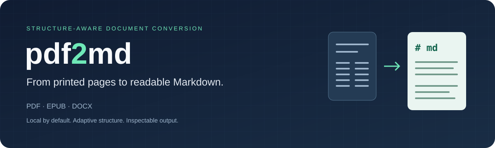
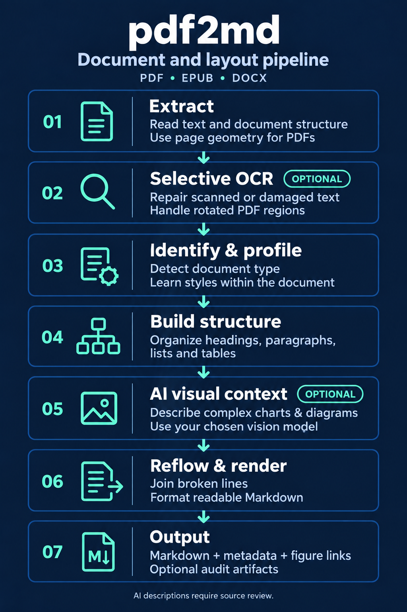

<p align="center">
  
</p>

<h1 align="center">pdf2md</h1>
<p align="center"><strong>Keep the words. Recover the structure. Better context. Save on tokens.</strong></p>
<p align="center">Turn books, research papers, and everyday documents in PDF, EPUB, and DOCX into clean, readable Markdown for archiving, agents and Graph RAG using an intricate document and layout pipeline.</p>

<p align="center">
  <a href="CHANGELOG.md"></a>
  <a href="https://github.com/machinarii/pdf2md/actions/workflows/ci.yml"></a>
  <a href="#quick-start"></a>
  <a href="LICENSE"></a>
</p>

<p align="center">
  <a href="#quick-start">Quick start</a> ·
  <a href="#framework">Framework</a> ·
  <a href="#see-the-output">Examples</a> ·
  <a href="#cleaner-input-for-graphrag">GraphRAG</a> ·
  <a href="#performance">Performance</a> ·
  <a href="CHANGELOG.md">Changelog</a> ·
  <a href="CONTRIBUTING.md">Contribute</a>
</p>

The document and layout pipeline combines PyMuPDF extraction, document-specific heuristics, and
an explicit document tree. Optional Tesseract OCR repairs selected regions, including rotated pages.
Optional AI computer vision interprets and describes complex diagrams and charts
to provide additional context for agents and RAG, using a user-selected vision model.
Descriptions remain linked to source images for review.
EPUB and DOCX use their own structural readers; LibreOffice handles older office
formats. The converter ships as one Python file with no required model download.

<p align="center">
  <a href="docs/assets/pipeline.png">
    
  </a>
</p>

| Feature | Benefit |
|---|---|
| 📖 **Readable text** | Reflow paragraphs and rejoin words split across printed lines. |
| 🧭 **Adaptive layout** | Infer headings and column reading order for books, papers, and reports. |
| 🔍 **Source traceability** | Inspect classified text, page locations, and optional OCR repair decisions. |
| 🕸️ **GraphRAG preparation** | Give downstream chunking and relationship extraction more coherent source text. |
| 🤖 **Agent-ready Markdown** | Clean, structured text supports selective reading that can reduce context tokens. |

## Quick start

Requires **Python 3.10+**. Clone the repository and install its dependency:

```bash
git clone https://github.com/machinarii/pdf2md.git
cd pdf2md
python3 -m venv .venv
source .venv/bin/activate
pip install -r requirements.txt
python3 pdf2md_all.py book.pdf -o book.md
```

On Windows, activate with `.venv\Scripts\activate` instead.

```bash
python3 pdf2md_all.py paper.pdf --no-toc -o paper.md
python3 pdf2md_all.py book.epub -o book.md
python3 pdf2md_all.py document.docx -o document.md
python3 pdf2md_all.py large.pdf --max-file-size 500MiB -o large.md
python3 pdf2md_all.py photos.pdf --skip-mostly-images -o photos.md
python3 pdf2md_all.py --version  # pdf2md 0.2.0
```

Output includes inferred headings, reflowed text, YAML metadata, and a table of
contents unless disabled. DOC, ODT, and RTF input additionally requires LibreOffice.
Use `--max-file-size SIZE` to refuse oversized input before parsing; decimal
(`MB`, `GB`) and binary (`MiB`, `GiB`) units are supported, as are raw bytes.
Run `python3 pdf2md_all.py --help` for all options.

## Framework

This section explains the layers,
structural decisions, and verification techniques behind it.

### Pipeline layers

Extraction supplies the evidence for document identification and profiling.
Classification assigns content roles; assembly turns those roles into Markdown.

```text
EXTRACT    Text spans + typography + geometry
           Read fonts, sizes, weights, and bounding boxes;
           normalize page rotation; infer page-local column reading order;
           optionally OCR damaged lines and empty image pages with auditing.

IDENTIFY   Book / paper / deck / document
           Combine metadata, geometry, text density, and document markers;
           record evidence and allow an explicit document-type override.

PROFILE    Learn the current document's patterns
           Body style     → dominant font and size by character count
           Running heads  → repeated margin text across distinct pages
           Heading styles → typography, frequency, spacing, and text shape
           OCR text layer → synthetic-font evidence and relative size tiers

CLASSIFY   Assign content roles and document regimes
           Heading | paragraph | caption | code | table | figure | footnote
           Apply genre-specific rules and distinguish front matter,
           body, references, glossary, notes, and index;
           merge caption wraps and associate footnote anchors.

ASSEMBLE   Structure → readable Markdown
           Merge wrapped headings → validate outline hierarchy
           → construct section / paragraph / list relationships
           → reflow text across lines, pages, and columns
           → render content + YAML metadata + optional grouped contents
           → export source-linked audit artifacts when requested.
```

### Methodology and principles

1. **Use source evidence.** Font, size, weight, position, and surrounding text
   inform structure; a short line alone is not enough to establish a heading.
2. **Adapt to the document.** Infer book, paper, deck, or general document, then
   learn repeated styles and page-local layout. Learning ends with the conversion.
3. **Make hierarchy explicit.** Validate heading numbering and parent relationships;
   group body lines into paragraphs and retain nested list relationships.
4. **Keep corrections inspectable.** OCR candidates must pass acceptance checks.
   Rejected repairs preserve the original text, and audit artifacts record decisions.
5. **Validate against the source.** Regression fixtures and source-annotated checks
   cover specific failure modes. Successful conversion does not prove faithful output.

### Techniques

| Technique | Purpose |
|---|---|
| **Page-local column detection** | Recover reading order when column layouts and page widths change. |
| **Typography and repeated-style learning** | Recognize headings, including recurring styles in unfamiliar documents. |
| **Running-header detection** | Identify repeated margin text across distinct pages. |
| **Paragraph and word reflow** | Join printed lines and preserve compounds observed elsewhere in the document. |
| **Document regimes** | Apply different rules to front matter, body, references, and indexes. |
| **Selective OCR with verification** | Target damaged lines and empty image pages instead of OCRing every page. |
| **Source-linked document tree** | Export sections, paragraphs, lists, and original text locations for inspection. |

These are practical, research-inspired methods, not pretrained layout models or
cross-document training. [Architecture and limitations](docs/architecture.md) ·
[Research context and OCR details](docs/usage.md#structure-selective-ocr-and-quality-evaluation)

## See the output

An excerpt from our original book fixture, converted by both tools without
postprocessing. pdf2md rejoins wrapped words and preserves paragraph continuity.

<table>
<tr><th>MarkItDown 0.1.7</th><th>pdf2md 0.2.0</th></tr>
<tr><td valign="top"><code>The archive connects readers with an inter-<br>
national community. Each record includes infor-<br>
mation about the source and its publication.<br>
The team records each decision through careful docu-<br>
mentation helps later readers verify the result.</code></td>
<td valign="top"><code>The archive connects readers with an international community. Each record includes information about the source and its publication. The team records each decision through careful documentation helps later readers verify the result.</code></td></tr>
</table>

[See the full comparison gallery](docs/output-gallery.md) for column order,
chapter headings, repeated headers, and compound hyphens, with source previews
and unedited outputs. These synthetic examples illustrate specific behaviors;
they are not an overall accuracy score.

### More examples

Expand the comparisons below for additional output from the same reproducible
fixtures. Text is copied from the recorded outputs, with limitations noted.

<details>
<summary><strong>Two-column paper: reading order and complete sections</strong></summary>

Same original two-column PDF, two unedited converter outputs. This small synthetic
example demonstrates paragraph reflow and reading order, not general accuracy.
Both tools use their local defaults; pdf2md only adds `--no-toc`. The comparison
shows the complete body from both outputs, including **1 Introduction** and
**2 Preservation**; only the title block and metadata are omitted.

[View the source page](examples/comparison/source.png)


<table>
<tr><th>MarkItDown 0.1.7</th><th>pdf2md 0.2.0</th></tr>
<tr><td valign="top"><code>1 Introduction<br>
<br>
2 Preservation<br>
<br>
A useful archive preserves the structure<br>
of a document as well as its words. Short<br>
lines on a printed page should become<br>
one readable paragraph in Markdown.<br>
<br>
Clear text is easier to search and review.<br>
Keep the source file so each conversion<br>
can be checked against the printed page.<br>
Record the tool version with the output.<br>
<br>
Research papers often place two columns<br>
on the same page. Reading order matters:<br>
finish the left column before continuing<br>
with the text at the top of the right.<br>
<br>
Automatic conversion still needs review.<br>
Complex tables and damaged characters<br>
can require a closer look at the source.<br>
A readable result is a useful first step.<br>
<br>
A heading should remain a heading.<br>
Its size and weight provide evidence<br>
that separates it from ordinary prose.<br>
The original page remains the reference.<br>
<br>
This small example illustrates headings<br>
and paragraph reflow on a simple layout.<br>
It is a demonstration, not a benchmark<br>
of every document or extraction method.</code></td>
<td valign="top"><code># 1 Introduction<br>
<br>
A useful archive preserves the structure of a document as well as its words. Short lines on a printed page should become one readable paragraph in Markdown.<br>
<br>
Research papers often place two columns on the same page. Reading order matters: finish the left column before continuing with the text at the top of the right.<br>
<br>
A heading should remain a heading. Its size and weight provide evidence that separates it from ordinary prose. The original page remains the reference.<br>
<br>
# 2 Preservation<br>
<br>
Clear text is easier to search and review. Keep the source file so each conversion can be checked against the printed page. Record the tool version with the output.<br>
<br>
Automatic conversion still needs review. Complex tables and damaged characters can require a closer look at the source. A readable result is a useful first step.<br>
<br>
This small example illustrates headings and paragraph reflow on a simple layout. It is a demonstration, not a benchmark of every document or extraction method.</code></td></tr>
</table>

Here, MarkItDown places the right-column heading before the left-column text,
and alternates paragraphs between columns. pdf2md keeps the left column together
and joins its printed lines into paragraphs. **pdf2md 0.2.0 recovers both numbered section headings**; MarkItDown retains
them as plain text. The earlier pdf2md 0.1.0 missed those heading tags. Neither converter drops the Preservation section: pdf2md places it after
the complete Introduction, following the source columns. The files below also
include each converter's title block and any generated metadata.

[Full pdf2md output](examples/comparison/pdf2md.md) ·
[Full MarkItDown output](examples/comparison/markitdown.md) ·
[Source generator and reproduction](examples/comparison/README.md)


</details>

<details>
<summary><strong>Keep real hyphens: self-supervised stays self-supervised</strong></summary>

<table>
<tr><th>MarkItDown 0.1.7</th><th>pdf2md 0.2.0</th></tr>
<tr><td valign="top"><code>A self-supervised method can identify patterns.<br>
Readers can inspect the training data. This self-<br>
supervised example also shows why every printed<br>
hyphen should not be removed in the same way.</code></td>
<td valign="top"><code>A self-supervised method can identify patterns. Readers can inspect the training data. This self-supervised example also shows why every printed hyphen should not be removed in the same way.</code></td></tr>
</table>

pdf2md uses the spelling elsewhere in the document to preserve the compound's
hyphen while removing its line break.

</details>

<details>
<summary><strong>Page boundaries: remove running headers and page numbers; restore heading tags</strong></summary>

<table>
<tr><th>MarkItDown 0.1.7</th><th>pdf2md 0.2.0</th></tr>
<tr><td valign="top"><code>Page furniture belongs outside the body text.<br>
A repeated running header provides navigation on<br>
paper, but becomes distracting inside an archive.<br>
Page numbers should not interrupt a paragraph.<br>
<br>
1<br>
<br>
␌FIELD NOTES ON DOCUMENT ARCHIVES<br>
<br>
Chapter 2: Checking</code></td>
<td valign="top"><code>Page furniture belongs outside the body text. A repeated running header provides navigation on paper, but becomes distracting inside an archive. Page numbers should not interrupt a paragraph.<br>
<br>
# Chapter 2: Checking</code></td></tr>
</table>

MarkItDown retains the page number and repeated running header between chapters.
pdf2md removes them and emits `# Chapter 2: Checking`. The visible `␌` represents
MarkItDown's form-feed character; that is the only display substitution here.

</details>

[Book source preview](examples/comparison/book/source.png) ·
[Complete pdf2md output](examples/comparison/book/pdf2md.md) ·
[Complete MarkItDown output](examples/comparison/book/markitdown.md) ·
[Reproduce these examples](examples/comparison/README.md#book-cleanup-gallery)

The full pdf2md output also shows a limitation: without a cover, its document title
falls back to the filename (`source`), despite the PDF metadata. The chapter
headings are recovered. No title override or output editing was used.


## OCR and inspection

For scans or damaged text, install Tesseract and the required language data, then:

```bash
python3 pdf2md_all.py scan.pdf -o scan.md --ocr auto --ocr-language eng \
  --artifacts artifacts/scan
```

OCR is optional and off by default. It targets empty image pages, damaged text
lines, and separate images on mixed pages, including PDF page rotations. It records
repair decisions and leaves rejected candidates unchanged. Regions overlapping
native text are skipped to avoid duplicating or replacing that text.
`--artifacts` also works without OCR to export the document tree and source evidence.
See [usage, OCR limits, and artifact details](docs/usage.md).

### Visual context for charts and images

Keep figures as images and optionally use a locally served Ollama vision model to
transcribe readable structure or describe axes, labels, trends, and relationships:

```bash
python3 pdf2md_all.py paper.pdf -o paper.md --figure-dir figures \
  --figure-vlm qwen3.8:27b --artifacts artifacts/paper
```

This requires a running Ollama server and an installed vision-capable model.
Choose any installed vision-capable tag with `--figure-vlm MODEL`; omit the flag
for images and extracted labels only. Use `--ollama-host http://SERVER:11434`
for a remote server.

| Preference | Tested option | Main limitation |
|---|---|---|
| Overall diagram explanations | `glm-5.3-flash:cloud` | Sends figures to the cloud; factual errors remain |
| Local descriptions and full tables | `qwen3.8:27b` | Incorrect comparisons and pin counts |
| Fast transcription | `glm-ocr:latest` | Repetition and weak relationship descriptions |
| Other local choices | `qwen3-vl:8b`, `qwen3-vl:30b` | Less complete tables and misleading chart trends |

These choices reflect four reviewed figures, not a general accuracy ranking.
[Results, timings and confidence limits](benchmarks/visual-context.md).
There is no calibrated accuracy-confidence score; generated text requires review.

Descriptions are marked **AI-generated**, linked to the crop, and recorded in
`figures/visuals.json` with model, page, bounding box, and image hash. Model failure
keeps the image and extracted labels. Review descriptions against the source;
these are contextual aids, not verified measurements or equation transcription.
[Visual context details](docs/usage.md#visual-context-for-rag)

## Cleaner input for GraphRAG

Correct reading order keeps unrelated topics apart. Intact words and paragraphs
give entity extraction coherent evidence; headings can guide a structure-aware
chunker. Removing repeated page furniture may reduce unnecessary indexing tokens.

These are expected benefits, not measured GraphRAG improvements. pdf2md prepares
text; your ingestion pipeline must map its structure and provenance into the graph.
See the [GraphRAG integration guide](docs/graphrag.md) for workflow and evaluation.

### Leaner context for agents and skills

Clean Markdown can reduce agent token usage by removing repeated headers and
footers and making sections easy to retrieve independently. Loading only the
relevant section keeps less text in context than loading an entire book.

Workflows such as [book-to-skill](https://github.com/virgiliojr94/book-to-skill)
take this further: they distill source material into a skill index and chapter
files that agents load on demand. pdf2md provides structured Markdown for this
kind of workflow; it does not itself generate skills or integrate with that tool.

Savings depend on cleanup, selective loading, and the model's tokenizer—not the
`.md` extension alone. Local token counts across **eight PDFs, 635 pages**, using
`o200k_base`. Savings below use a **shared illustrative full-PDF baseline** of
832,558 tokens (raw text plus an assumed 500 image tokens/page):

| Representation | Tokens across the sample | Estimated savings vs full PDF |
|---|---:|---:|
| Full PDF input (text + page images) | 832,558 (estimated baseline) | 0% |
| Unclean Markdown (MarkItDown 0.1.7) | 576,795 (measured) | 30.7% |
| Raw PDF text (PyMuPDF, no cleanup) | 515,058 (measured) | 38.1% |
| **Clean Markdown (pdf2md 0.2.0)** | **459,856 (measured)** | **44.8%** |

For full PDFs, [OpenAI's file-input processing](https://developers.openai.com/api/docs/guides/file-inputs)
includes text and page images. Using our raw-text count as a proxy and **assuming
500 image tokens/page** gives **832,558 tokens**, or **44.8% fewer** with clean
Markdown. This is an illustration, not measured API usage; actual extraction and
image costs depend on the model and detail settings. Markdown alone omits visual
information unless relevant figures are supplied separately.

Using only measured text counts, pdf2md uses **20.3% fewer tokens than MarkItDown**
and **10.7% fewer than raw PDF text** on this sample.

These are development-sample counts, not end-to-end agent benchmarks. One report
used 1.8% more tokens than MarkItDown; fewer tokens alone do not establish fidelity.
[Per-file counts, methodology, and limitations](benchmarks/token-usage.md)

## Performance

An earlier development comparison used **eight readable PDFs, 635 pages**, and
three trials per converter:

| Metric | pdf2md | MarkItDown 0.1.7 |
|---|---:|---:|
| Sum of per-file median conversion times | 5.41 s | 38.31 s |
| Selected source-grounded checks | 42/42 | 20/42 |

That is about **7.1× faster conversion on this sample**. The sample informed fixes
and predates later changes; it is not a held-out benchmark, a comprehensive
formatting audit, or a GraphRAG speed measurement.
[Methodology and limitations](benchmarks/comparison-2026-09-19.md) ·
[Run your own comparison](benchmarks/README.md)

## Known gaps

- Complex columns, tables, heading styles, and footnotes can still be misclassified.
- Equations are not reconstructed into faithful LaTeX. Unicode heading checks and Chinese/Japanese line joining are supported, but document-regime vocabulary remains mainly English; broad multilingual accuracy is unmeasured.
- OCR can misread text. Images overlapping native text are skipped; arbitrary text orientation, camera skew, and physical-book dewarping remain unsupported. Visual descriptions require review.
- Layout learning applies within a document; there is no cross-document training.

Inspect important outputs against their source. See [architecture and limitations](docs/architecture.md).

## Documentation and contributing

- [Usage and CLI reference](docs/usage.md)
- [Full output gallery](docs/output-gallery.md) and [reproduction scripts](examples/comparison/README.md)
- [GraphRAG guide](docs/graphrag.md)
- [Architecture](docs/architecture.md), [benchmarks](benchmarks/README.md), and [changelog](CHANGELOG.md)

Bug reports and source-backed improvements are welcome. See [CONTRIBUTING.md](CONTRIBUTING.md)
for setup and checks. CI tests Python 3.10–3.13, including optional OCR integration.

Licensed under the [MIT License](LICENSE).
