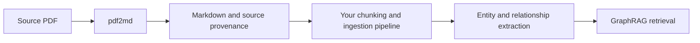

[← README](../README.md)

# Cleaner input for GraphRAG

**Better associations start with better source text.** pdf2md prepares readable
Markdown from PDFs for downstream retrieval systems; it does not build a knowledge
graph itself or modify the original PDF.

Microsoft GraphRAG extracts entities and relationships from text chunks, then
builds communities and summaries. Errors introduced during PDF extraction can
therefore propagate beyond the text into the graph. See Microsoft's
[indexing dataflow](https://microsoft.github.io/graphrag/index/default_dataflow/).



The following are expected benefits of cleaner input, not measured GraphRAG gains:

| Cleanup | Why it matters for associations and retrieval |
|---|---|
| **Restore reading order** | Keeping each sentence with its own paragraph reduces accidental mixing of unrelated subjects from adjacent columns. This gives relationship extraction more coherent evidence. |
| **Rejoin broken words** | Recovering `international` from `inter-` / `national` can reduce fragmented terms in search, entity matching, and topic representations. It does not resolve aliases or guarantee correct entity linking. |
| **Preserve headings and paragraphs** | A structure-aware chunker can keep a claim with its explanation and carry its section title as context, helping distinguish methods, results, and limitations. |
| **Remove repeated page furniture** | Excluding running headers and page numbers reduces repeated irrelevant text that can distract extraction or dominate topic signals. |
| **Retain source provenance** | Page references, bounding boxes, and original extracted text let an ingestion pipeline trace a proposed relationship back to its evidence for review. |

For example, a column-order error can place an author discussing battery recycling
beside an unrelated paragraph about cancer treatment. Restoring the two passages
reduces that artificial adjacency. This matters especially for methods that infer
relationships from co-occurrence within a chunk, as
[FastGraphRAG does](https://microsoft.github.io/graphrag/index/methods/).
This is an illustrative failure mechanism, not a measured result for this project.

### Speed and indexing efficiency

Removing redundant text can reduce tokens sent to embedding and extraction models.
If that also reduces chunk count, it may reduce model calls, indexing time, and
storage. Cleaner passages may need less manual cleanup and reprocessing. Simply
joining line breaks does **not** guarantee fewer tokens or faster queries: those
outcomes depend on tokenization, chunk size, overlap, models, and graph size.

The measured **~7.1× conversion speedup** in the earlier development sample applies
only to PDF-to-Markdown conversion versus MarkItDown. It is **not** a GraphRAG
indexing or query speedup. We have not yet measured changes in entity/relationship
precision, topic association quality, retrieval accuracy, or end-to-end GraphRAG
latency. See [the comparison limits](../benchmarks/comparison-2026-09-19.md).

### Using the output

```bash
python3 pdf2md_all.py paper.pdf -o paper.md --no-toc --artifacts artifacts/paper
```

In your ingestion pipeline, separate YAML metadata from prose, use headings and
paragraphs as chunking cues, and preserve source references from `document.json`.
The document tree describes layout structure, not semantic entity relationships.
GraphRAG does not automatically consume pdf2md's tree or bounding boxes; your
adapter must map them to its input and provenance fields. Review extraction errors
before indexing, since incorrect cleanup can also remove useful evidence.

To validate the benefit, compare both conversions on identical held-out documents
with the same GraphRAG settings. Measure token and chunk counts, model calls,
indexing time, entity/relationship precision and recall, and retrieval quality on
source-answered questions. Evaluate query latency separately from indexing time.

