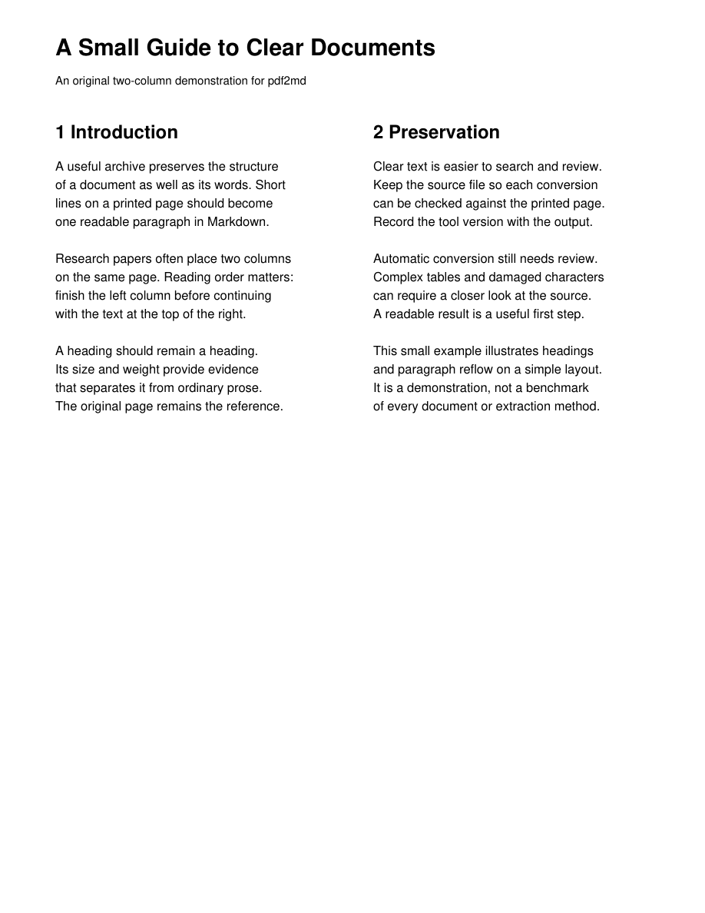

[← README](../README.md)

# Output gallery

Same original two-column PDF, two unedited converter outputs. This small synthetic
example demonstrates paragraph reflow and reading order, not general accuracy.
Both tools use their local defaults; pdf2md only adds `--no-toc`. The comparison
shows the complete body from both outputs, including **1 Introduction** and
**2 Preservation**; only the title block and metadata are omitted.

View the source page

<table>
<tr><th>MarkItDown 0.1.7</th><th>pdf2md 0.2.0</th></tr>
<tr><td valign="top"><code>1 Introduction 
 
2 Preservation 
 
A useful archive preserves the structure 
of a document as well as its words. Short 
lines on a printed page should become 
one readable paragraph in Markdown. 
 
Clear text is easier to search and review. 
Keep the source file so each conversion 
can be checked against the printed page. 
Record the tool version with the output. 
 
Research papers often place two columns 
on the same page. Reading order matters: 
finish the left column before continuing 
with the text at the top of the right. 
 
Automatic conversion still needs review. 
Complex tables and damaged characters 
can require a closer look at the source. 
A readable result is a useful first step. 
 
A heading should remain a heading. 
Its size and weight provide evidence 
that separates it from ordinary prose. 
The original page remains the reference. 
 
This small example illustrates headings 
and paragraph reflow on a simple layout. 
It is a demonstration, not a benchmark 
of every document or extraction method.</code></td>
<td valign="top"><code># 1 Introduction 
 
A useful archive preserves the structure of a document as well as its words. Short lines on a printed page should become one readable paragraph in Markdown. 
 
Research papers often place two columns on the same page. Reading order matters: finish the left column before continuing with the text at the top of the right. 
 
A heading should remain a heading. Its size and weight provide evidence that separates it from ordinary prose. The original page remains the reference. 
 
# 2 Preservation 
 
Clear text is easier to search and review. Keep the source file so each conversion can be checked against the printed page. Record the tool version with the output. 
 
Automatic conversion still needs review. Complex tables and damaged characters can require a closer look at the source. A readable result is a useful first step. 
 
This small example illustrates headings and paragraph reflow on a simple layout. It is a demonstration, not a benchmark of every document or extraction method.</code></td></tr>
</table>

Here, MarkItDown places the right-column heading before the left-column text,
and alternates paragraphs between columns. pdf2md keeps the left column together
and joins its printed lines into paragraphs. **pdf2md 0.2.0 recovers both numbered section headings**; MarkItDown retains
them as plain text. The earlier pdf2md 0.1.0 missed those heading tags. Neither converter drops the Preservation section: pdf2md places it after
the complete Introduction, following the source columns. The files below also
include each converter's title block and any generated metadata.

[Full pdf2md output](../examples/comparison/pdf2md.md) ·
[Full MarkItDown output](../examples/comparison/markitdown.md) ·
[Source generator and reproduction](../examples/comparison/README.md)

### More cleanup examples

Three more contrasts from the same original three-page book fixture. These are
selected demonstrations, not a representative failure rate. Both converters use
the same settings as above; excerpts are copied from the complete outputs.

<strong>Broken words: inter- / national, infor- / mation, docu- / mentation</strong>

<table>
<tr><th>MarkItDown 0.1.7</th><th>pdf2md 0.2.0</th></tr>
<tr><td valign="top"><code>The archive connects readers with an inter- 
national community. Each record includes infor- 
mation about the source and its publication. 
The team records each decision through careful docu- 
mentation helps later readers verify the result.</code></td>
<td valign="top"><code>The archive connects readers with an international community. Each record includes information about the source and its publication. The team records each decision through careful documentation helps later readers verify the result.</code></td></tr>
</table>

pdf2md rejoins the split words and reconstructs the paragraph.

<strong>Keep real hyphens: self-supervised stays self-supervised</strong>

<table>
<tr><th>MarkItDown 0.1.7</th><th>pdf2md 0.2.0</th></tr>
<tr><td valign="top"><code>A self-supervised method can identify patterns. 
Readers can inspect the training data. This self- 
supervised example also shows why every printed 
hyphen should not be removed in the same way.</code></td>
<td valign="top"><code>A self-supervised method can identify patterns. Readers can inspect the training data. This self-supervised example also shows why every printed hyphen should not be removed in the same way.</code></td></tr>
</table>

pdf2md uses the spelling elsewhere in the document to preserve the compound's
hyphen while removing its line break.

<strong>Page boundaries: remove running headers and page numbers; restore heading tags</strong>

<table>
<tr><th>MarkItDown 0.1.7</th><th>pdf2md 0.2.0</th></tr>
<tr><td valign="top"><code>Page furniture belongs outside the body text. 
A repeated running header provides navigation on 
paper, but becomes distracting inside an archive. 
Page numbers should not interrupt a paragraph. 
 
1 
 
␌FIELD NOTES ON DOCUMENT ARCHIVES 
 
Chapter 2: Checking</code></td>
<td valign="top"><code>Page furniture belongs outside the body text. A repeated running header provides navigation on paper, but becomes distracting inside an archive. Page numbers should not interrupt a paragraph. 
 
# Chapter 2: Checking</code></td></tr>
</table>

MarkItDown retains the page number and repeated running header between chapters.
pdf2md removes them and emits `# Chapter 2: Checking`. The visible `␌` represents
MarkItDown's form-feed character; that is the only display substitution here.

[Book source preview](../examples/comparison/book/source.png) ·
[Complete pdf2md output](../examples/comparison/book/pdf2md.md) ·
[Complete MarkItDown output](../examples/comparison/book/markitdown.md) ·
[Reproduce these examples](../examples/comparison/README.md#book-cleanup-gallery)

The full pdf2md output also shows a limitation: without a cover, its document title
falls back to the filename (`source`), despite the PDF metadata. The chapter
headings are recovered. No title override or output editing was used.

